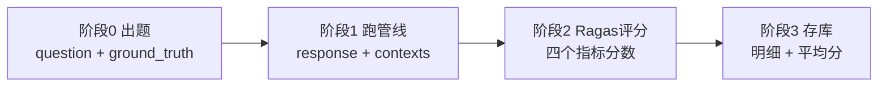
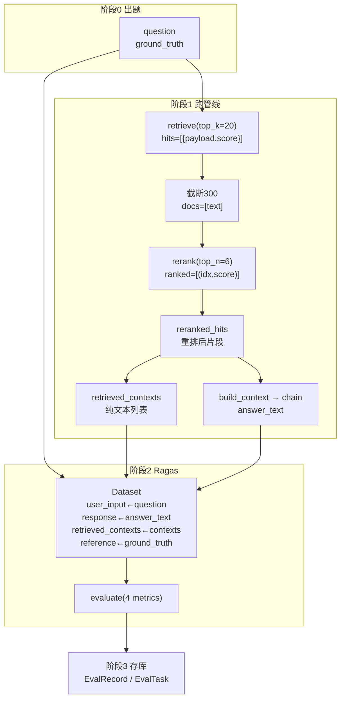

# Ragas 评估落地详解：数据是怎么一步步喂给 Ragas 的

> 一句话先记住核心：**Ragas 只认四个字段——`user_input`、`response`、`retrieved_contexts`、`reference`。** 你的全部工作，就是把 RAG 管线跑出来的数据映射到这四个字段上，剩下的打分交给它。本文以本项目的真实源码为例，把"每个阶段的数据怎么流、怎么喂"用代码 + 注释讲清楚。

---

## 一、全景：三个阶段的完整数据流

评估全流程在 `backend/app/services/eval_service.py` 里，分三个阶段，每个阶段有明确的"输入 → 产出"：



| 阶段 | 干什么 | 输入 | 产出 | 代码位置 |
|------|--------|------|------|----------|
| 0 出题 | 用 LLM 从文档生成问答对 | 文档内容 | `question` + `ground_truth` | `generate_questions()` :47 |
| 1 跑管线 | 逐题跑一遍 RAG，攒四元组 | `question` | `response` + `retrieved_contexts` | `_run_evaluation_background()` :144 |
| 2 评分 | 把四元组喂给 Ragas | 四元组 | 4 个指标分数 | `_run_ragas_scoring()` :245 |
| 3 存库 | 分数落库 | 分数 | `EvalRecord` / `EvalTask` | `_run_evaluation_background()` :205 |

> 关键认知：**Ragas 在阶段 2 才登场**。阶段 0、1 都是你的项目自己的代码在准备数据，Ragas 只负责阶段 2 的打分。

---

## 二、阶段 0：出题（生产 `ground_truth`）

`ground_truth`（标准答案）是 `reference` 字段的来源，评估准不准，一半取决于它。本项目用项目自己的 LLM 读文档生成：

```python
# eval_service.py:47 generate_questions()
llm = ChatOpenAI(
    model=model,                    # settings.llm_model，默认 qwen-plus
    openai_api_key=api_key,         # 复用 DashScope key
    openai_api_base=base_url,
    temperature=0.7,                # 出题要高一点，题目才多样
)

content_trimmed = content[:4000]    # 只读前 4000 字符，防超长

prompt = f"""你是一位专业的产品知识质量评估专家。请根据以下文档内容，生成 {num_per_doc} 道问答题。
要求：
1. 问题应覆盖文档的不同章节和关键信息点
2. 问题要具体、可验证，不要过于笼统
3. 标准答案（ground_truth）必须完全基于文档内容，引用具体数据和事实
4. 严格按 JSON 数组格式输出
文档内容：..."""

resp = await llm.ainvoke(prompt)
items = json.loads(text)            # 解析出 [{question, ground_truth}, ...]
```

**这一阶段的产出**（后面所有阶段的数据源头）：

```python
questions = [
    {"question": "清风K3Pro的滤芯多久换一次？", "ground_truth": "建议6个月更换一次滤芯。"},
    {"question": "...", "ground_truth": "..."},
]
```

> 注意：出题用的是 `qwen-plus`（temperature 0.7），而评分阶段的裁判用的是 `qwen-max`（temperature 0.0）。**出题模型 ≠ 裁判模型**，这是有意的设计：更强的模型批卷。

---

## 三、阶段 1：跑管线备料（生产 `response` + `retrieved_contexts`）

这是**最关键的一段**——你之前问"评估时拿重排后片段的代码在哪"，答案就在这里。逐行拆解 `_run_evaluation_background()` 的第 155–177 行：

```python
# eval_service.py:155 —— 第 1 步：向量召回 20 条
# retrieve() 定义在 app/rag/retriever.py，返回 [{payload, score}]，按相似度降序
hits = await retrieve(question, top_k=20)

if hits:
    # 第 2 步：每条截断到 300 字符，作为重排的输入
    # 注意：这里取 payload 里的 text 或 chunk_content 字段
    docs = [
        (h.get("payload", {}).get("text") or h.get("payload", {}).get("chunk_content") or "")[:300]
        for h in hits
    ]

    # 第 3 步：云端重排，返回 top 6 的 [(原始索引, 分数)]
    # rerank() 定义在 app/rag/reranker.py，返回 [(index, score)]，按分数降序
    ranked = await reranker.rerank(question, docs, top_n=6)

    # 第 4 步 ★：按重排返回的索引，从 hits 里捞回片段 —— 这就是"重排序之后的片段"
    # ranked 里装的是 (index, score)，index 对应 docs 的下标，也对应 hits 的下标
    reranked_hits = [hits[idx_r] for idx_r, _ in ranked]
else:
    reranked_hits = []

# 第 5 步：从重排后的片段里提取纯文本 → 这就是喂给 Ragas 的 retrieved_contexts
retrieved_contexts = [
    hit.get("payload", {}).get("text") or hit.get("payload", {}).get("chunk_content") or ""
    for hit in reranked_hits
]

# 第 6 步：拼装编号上下文（[1] [2] ...），喂给生成链
# build_context() 定义在 app/rag/prompt.py
context_str = build_context(reranked_hits)

# 第 7 步：LCEL 链生成答案
# build_chat_pipeline() 定义在 app/rag/chain.py，内部是 system + history + human 三段式 prompt
pipeline = build_chat_pipeline()
response = await pipeline.ainvoke({
    "context": context_str,     # 第 6 步拼好的编号上下文
    "question": question,       # 原始问题
    "history": [],              # 评估是单轮，历史恒为空
})
answer_text = response.content if hasattr(response, "content") else str(response)
```

**每一步的数据长什么样**（用上面的例子直观感受数据流转）：

```python
# 第 1 步 hits：20 条候选，每条带 payload 和相似度分数
hits = [
    {"payload": {"text": "滤芯建议每6个月更换一次...", "doc_id": "..."}, "score": 0.83},
    {"payload": {"text": "机器采用HEPA过滤技术...",   "doc_id": "..."}, "score": 0.81},
    ...  # 共 20 条
]

# 第 2 步 docs：只取文本、截断到 300 字符，给 rerank 用
docs = ["滤芯建议每6个月更换一次...", "机器采用HEPA过滤技术...", ...]

# 第 3 步 ranked：rerank 返回的是索引 + 分数，不是片段本身
ranked = [(0, 0.96), (5, 0.88), (2, 0.71), (11, 0.60), (3, 0.42), (7, 0.31)]

# 第 4 步 reranked_hits：按索引捞回原始片段，顺序已经按 rerank 分数排好
reranked_hits = [hits[0], hits[5], hits[2], hits[11], hits[3], hits[7]]

# 第 5 步 retrieved_contexts：抽成纯文本列表（Ragas 要的就是这个）
retrieved_contexts = [
    "滤芯建议每6个月更换一次...",
    "（hits[5] 的文本）",
    ...  # 共 6 条
]

# 第 6 步 context_str：编号拼装，模型看到的是 "[1] xxx\n\n[2] xxx"
context_str = "[1] 滤芯建议每6个月更换一次...\n\n[2] ...\n\n[3] ..."

# 第 7 步 answer_text：最终答案
answer_text = "滤芯建议每6个月更换一次。[1]"
```

到这里，一题就攒齐了四个字段中的三个（`question`、`response`、`retrieved_contexts`），加上阶段 0 的 `ground_truth`，四元组齐了：

```python
records_data.append({
    "question": question,                    # → 将映射为 user_input
    "ground_truth": ground_truth,            # → 将映射为 reference
    "response": answer_text,                 # → 将映射为 response
    "retrieved_contexts": retrieved_contexts, # → 将映射为 retrieved_contexts
})
```

---

## 四、阶段 2：Ragas 评分（喂料 + 字段映射）

这是 `_run_ragas_scoring()`（:245），**Ragas 真正登场的地方**：

```python
# eval_service.py:245 _run_ragas_scoring()
from datasets import Dataset
from langchain_openai import ChatOpenAI
from ragas import evaluate
from ragas.embeddings import LangchainEmbeddingsWrapper
from ragas.llms import LangchainLLMWrapper
from ragas.metrics import answer_relevancy, context_precision, context_recall, faithfulness

from app.rag.embedder import get_cached_embedder   # 复用生产的 embedding

# ── 1. 配置裁判模型（批卷的"老师"）────────────────────────
# 用 qwen-max 当裁判，temperature=0.0 保证打分稳定可复现
judge_llm = LangchainLLMWrapper(
    ChatOpenAI(model="qwen-max", openai_api_key=api_key, openai_api_base=base_url, temperature=0.0)
)
# 复用生产的 embedding（text-embedding-v3, 1024 维），answer_relevancy 算相似度要用
judge_embeddings = LangchainEmbeddingsWrapper(get_cached_embedder())

# ── 2. 字段映射：把阶段1攒的四元组，映射成 Ragas 认识的字段 ──
hf_dataset = Dataset.from_dict({
    "user_input":         [r["question"] for r in records_data],          # ← question
    "response":           [r["response"] for r in records_data],          # ← answer_text
    "retrieved_contexts": [r["retrieved_contexts"] for r in records_data], # ← retrieved_contexts
    "reference":          [r["ground_truth"] for r in records_data],      # ← ground_truth
})

# ── 3. 调用 Ragas 评分 ────────────────────────────────────
results = evaluate(
    dataset=hf_dataset,
    metrics=[faithfulness, answer_relevancy, context_precision, context_recall],
    llm=judge_llm,
    embeddings=judge_embeddings,
)

# ── 4. 把分数回填到每条记录 ────────────────────────────────
df = results.to_pandas()
for idx, rec in enumerate(records_data):
    row = df.iloc[idx]
    rec["faithfulness"]       = float(row.get("faithfulness", 0) or 0)
    rec["answer_relevancy"]   = float(row.get("answer_relevancy", 0) or 0)
    rec["context_precision"]  = float(row.get("context_precision", 0) or 0)
    rec["context_recall"]     = float(row.get("context_recall", 0) or 0)
```

**这段代码的灵魂，就是中间那个字段映射表**。它把"你的数据结构"翻译成"Ragas 的数据结构"：

| 你的数据（records_data 的 key） | Ragas 字段 | 来源阶段 |
|-------------------------------|-----------|----------|
| `question` | `user_input` | 阶段 0 出题 |
| `ground_truth` | `reference` | 阶段 0 出题 |
| `response` | `response` | 阶段 1 管线 |
| `retrieved_contexts` | `retrieved_contexts` | 阶段 1 管线 |

这就是"每个 RAG 系统代码不同、但都能用 Ragas"的原因——**不管你的管线怎么实现，只要最后能凑齐这四列数据，就能喂给 Ragas**。

---

## 五、四个指标到底"吃"哪几个字段

不同指标只会用到四元组里的部分字段，理解这一点，你就知道"哪个指标被哪段代码影响"：

| 指标 | 需要的字段 | 含义 |
|------|-----------|------|
| `faithfulness` | `response` + `retrieved_contexts` | 答案有多大比例能被上下文支撑 |
| `answer_relevancy` | `user_input` + `response` | 答案是否紧扣问题 |
| `context_precision` | `user_input` + `reference` + `retrieved_contexts` | 上下文是否相关、排序是否正确 |
| `context_recall` | `user_input` + `reference` + `retrieved_contexts` | 标准答案的信息是否都被检索覆盖 |

对照阶段 1 的代码，可以得出一个很实用的结论：

- 两个 **context 指标**（precision / recall）吃的是第 5 步的 `retrieved_contexts` → **所以 `top_k=20`、`top_n=6`、`rerank` 的质量、`chunk_size` 都直接影响它们**。
- `faithfulness` 吃的是 `response` + `retrieved_contexts` → **所以生成链的 `SYSTEM_PROMPT`、上下文质量、`temperature`、`llm_model` 影响它**。
- `answer_relevancy` 吃的是 `user_input` + `response` → **所以生成链切不切题、出题质量影响它**。

---

## 六、阶段 3：存库

Ragas 返回分数后，写进两张表（`_run_evaluation_background()` :205）：

```python
# 每题一条明细记录
record = EvalRecord(
    id=str(uuid.uuid4()),
    task_id=task_id,
    question=rec["question"],
    ground_truth=rec["ground_truth"],
    response=rec["response"],
    retrieved_contexts=json.dumps(rec["retrieved_contexts"], ensure_ascii=False),  # 上下文存 JSON 字符串
    faithfulness=rec.get("faithfulness"),
    answer_relevancy=rec.get("answer_relevancy"),
    context_precision=rec.get("context_precision"),
    context_recall=rec.get("context_recall"),
)
db.add(record)

# 累加后算平均分，写回任务汇总
sum_f += rec.get("faithfulness") or 0
...
task.avg_faithfulness = round(sum_f / count, 4) if count else None
task.avg_context_recall = round(sum_cr / count, 4) if count else None
task.status = "done"
```

- `EvalRecord`：每题一行，含四元组 + 四个分数（用于前端看单题明细）
- `EvalTask`：任务一行，含四个平均分（用于前端看整体水平）

---

## 七、完整数据流一图总结



---

## 八、实战：逐字段读一份真实的 ragas_eval_report.csv

评估跑完后会导出一份 `ragas_eval_report.csv`，一共 8 列。这 8 列恰好分成两部分：**前 4 列是我们喂给 Ragas 的输入，后 4 列是 Ragas 打的分**。

| 列名 | 属于哪部分 | 谁产生的 |
|------|-----------|----------|
| `user_input` / `retrieved_contexts` / `response` / `reference` | 输入数据 | 我们的 RAG 管线 |
| `faithfulness` / `answer_relevancy` / `context_precision` / `context_recall` | 评测得分 | Ragas |

### 8.1 输入字段（我们 RAG 系统产生的数据）

这四个字段是在调用 `ragas.evaluate()` **之前**，由我们自己的管线生成并喂进去的：

| 字段 | 含义 | 对应管线里的哪个变量 |
|------|------|----------------------|
| `user_input` | 测试题目，即大模型根据文档生成的"问题" | `question` |
| `retrieved_contexts` | 向量库检索 + 重排后，针对该问题搜出的所有文档片段集合 | `retrieved_contexts` |
| `response` | 系统基于上述片段最终生成的回答 | `answer_text` |
| `reference` | 这道题的标准答案，出题时一并生成的正确答案 | `ground_truth` |

### 8.2 评测指标字段（Ragas 给出的得分）

这四个指标构成 Ragas 四维评估体系，得分范围 **0.0 ~ 1.0，越接近 1.0 越好**：

**`faithfulness`（忠实度 / 幻觉测试）**
评估 `response` 是否完全基于 `retrieved_contexts`。
**低分原因**：模型"脱稿发挥"，编造了检索片段里根本没出现的信息（即常说的"幻觉"）。

**`answer_relevancy`（回答相关性）**
评估 `response` 是否"直接切题"地回答了 `user_input`。
**低分原因**：答非所问、避重就轻，或包含大量与问题无关的废话。

**`context_precision`（上下文精确度）**
评估 `retrieved_contexts` 是不是"干货满满"，且有用的片段是否排在最前面。
**低分原因**：搜出的 6 个片段里只有最后 1 个真正有用、前 5 个全是毫不相干的废话。这个指标主要评估你的**检索（Retrieve）和重排（Rerank）**能力。

**`context_recall`（上下文召回率）**
评估 `retrieved_contexts` 是否包含了能拼出标准答案 `reference` 的所有必要信息。
**低分原因**：参考答案提到 A、B、C 三个关键点，但向量库只搜到包含 A 的片段、漏了 B 和 C。说明知识库切片或检索策略漏掉了关键信息。

### 8.3 案例：第三条数据为什么被打了 0 分

看 CSV 里的第三条真实数据：

| 字段 | 内容（摘要） |
|------|-------------|
| `user_input` | 如何配置高并发下的数据库连接池参数？ |
| `response` | 侃侃而谈给了四条建议：最大连接数、最小空闲连接数、连接超时、验证查询 |
| `reference` | 需将 `pool_size` 设为 20、`max_overflow` 设为 10，并开启 `pool_pre_ping` 探针 |
| `retrieved_contexts` | 全是个人简历 / SOC 平台项目经验（噪音），完全不包含 pool_size 等信息 |

Ragas 的真实评分：

| 指标 | 真实得分 | 解读 |
|------|---------|------|
| `faithfulness` | **0.125** | 极低——回答里大量内容在检索片段里根本没出现，属于强行编造 |
| `context_precision` | **0.0** | 检索片段完全不相关，全是不相干的噪音 |
| `context_recall` | **0.0** | 片段里完全没有 reference 提到的 `pool_size=20` 等信息 |
| `answer_relevancy` | **0.939** | 单看"问题 ↔ 回答"，语气和结构确实像在回答这个问题，只是内容全错 |

**这条数据的价值在于它同时展示了四个指标的分工**：

- `answer_relevancy` 只看"像不像在回答"——所以它给了 0.939 高分，因为回答的结构没毛病；
- `context_precision` / `context_recall` 只看"检索对不对"——所以直接 0 分，因为检索全是噪音；
- `faithfulness` 只看"答案有没有编"——所以 0.125，因为答案大部分是凭空编的。

**根因**：这道题对应的测试文档当时**没有入库**，RAG 系统从库里搜出来的全是其他文档（个人简历、项目经验），模型只能强行胡说八道，最终被 Ragas 精准识别并给了 0 分。

> 一条重要教训：**RAG 答案质量的天花板是被检索质量锁死的。** 检索全是噪音时，再强的生成模型也救不回来——四个指标里三个都指向检索环节，就是最直接的证据。

---

## 九、一个必须知道的坑：评估管线 ≠ 生产管线

阶段 1 的这段代码是**简化版**管线，和生产链路（`chat_service.py`）对不上：

| 环节 | 生产（`chat_service.py`） | 评估（`eval_service.py` :155-161） |
|------|--------------------------|-----------------------------------|
| 召回 top_k | `retrieve_dense_top_k = 100` | **硬编码 `top_k=20`** |
| 多样性采样 | `_diverse_candidates()`（每文档 ≤8） | **没有** |
| 精排 top_n | `rerank_top_n × 2 = 12`（overfetch） | **硬编码 `top_n=6`** |
| 内容去重 | 有 | **没有** |

**后果**：评估得到的分数描述的是"简化版管线"，不能 100% 代表线上体验；按评估分数调生产参数会"评测没变、生产变了"。

**建议**：把评估里的 `top_k=20`、`top_n=6` 改成读 `settings`，或直接抽出生产链路的 `_retrieve_rank()` 复用，让"测的就是上线的"。

---

## 十、指标含义 + 优化速查表

| 指标 | 中文 | 测什么 | 吃哪些字段 | 主要优化杠杆 |
|------|------|--------|-----------|--------------|
| Faithfulness | 忠实度 | 答案是否忠于上下文（反幻觉） | response + contexts | `SYSTEM_PROMPT`、`rerank_top_n`、`temperature`、`llm_model` |
| Answer Relevancy | 答案相关性 | 答案是否切题 | user_input + response | `SYSTEM_PROMPT`、检索相关性、出题质量 |
| Context Precision | 上下文精确率 | 检索是否相关、排序是否正确 | user_input + reference + contexts | `rerank`、`rerank_top_n`、`embedding`、去重 |
| Context Recall | 上下文召回率 | 该找的是否都找到（防漏检） | user_input + reference + contexts | `top_k`、`chunk_size/overlap`、混合检索、`embedding` |

---

*本文基于项目实际源码，涉及文件：`backend/app/services/eval_service.py`（核心）、`backend/app/rag/retriever.py`、`reranker.py`、`prompt.py`、`chain.py`、`embedder.py`。Ragas 版本 0.4.3。*
